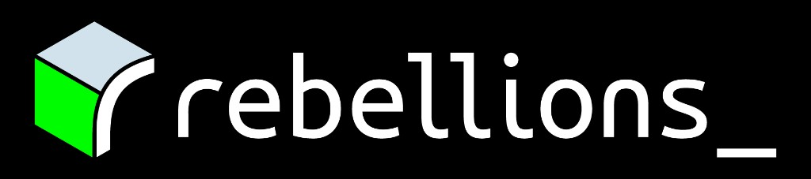

<div align="center">



*AI serving with RBLN NPUs · Compile once, Run anywhere · 500+ models — start here*

# RBLN Model Zoo

[](https://rebellions.ai/developers/model-zoo)
[](https://docs.rbln.ai)

[](https://docs.rbln.ai/supports/version_matrix.html)
[](https://docs.rbln.ai/supports/version_matrix.html)
[](https://docs.rbln.ai/supports/version_matrix.html)
[](https://docs.rbln.ai/supports/version_matrix.html)

</div>

---

## Quick Start

```bash
pip install -i https://pypi.rbln.ai/simple rebel-compiler
cd huggingface/transformers/text2text-generation/llama/llama3.1-8b
pip install -r requirements.txt
python compile.py && python inference.py
```

Compile once, run anywhere.

> [RBLN portal account](https://docs.rbln.ai/getting_started/installation_guide.html) required

---

## Frameworks

Your starting point for AI serving on RBLN NPUs.

| Framework | Models | 역할 |
|-----------|--------|------|
| Hugging Face | 150+ | Transformers, diffusers |
| PyTorch | 250+ | TorchVision, custom models |
| TensorFlow | 75+ | Keras, TF models |
| C API | — | C/C++ inference. Install via [APT](https://docs.rbln.ai/software/api/language_binding/c/installation.html), then compile and run from `cpp/` |

---

## Deployment

**vLLM-RBLN** — compile from Model Zoo, then serve:

```bash
python compile.py
pip install vllm-rbln
```

```python
from vllm import LLM, SamplingParams

llm = LLM(model="Llama-3.1-8B-Instruct")
out = llm.generate(["Hello"], SamplingParams(max_tokens=64))
print(out[0].outputs[0].text)
```

- [vLLM-RBLN](https://docs.rbln.ai/software/model_serving/vllm_support/vllm-rbln.html) — LLM serving on RBLN NPU
- [Triton](https://docs.rbln.ai/software/model_serving/nvidia_triton_inference_server/installation.html) — NVIDIA inference server
- [TorchServe](https://docs.rbln.ai/software/model_serving/torchserve/torchserve.html) — PyTorch model serving

---

**Resources**

- [CHANGELOG](CHANGELOG.md) — version history
- [Issues](https://github.com/RBLN-SW/rbln-model-zoo/issues) — have questions? Open an issue.
