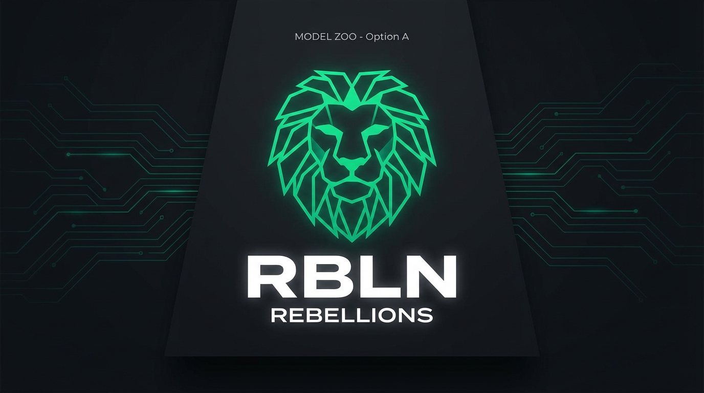

<div align="center">

<picture>
  <source media="(prefers-color-scheme: dark)" srcset="assets/rbln-model-zoo-a-lion-light.png">
  <source media="(prefers-color-scheme: light)" srcset="assets/rbln-model-zoo-a-lion-dark.png">
  
</picture>

*AI serving with RBLN NPUs · Compile once, Run anywhere · 500+ models — start here*

# RBLN Model Zoo

[](https://rebellions.ai/developers/model-zoo)
[](https://docs.rbln.ai)
[](https://docs.rbln.ai/supports/version_matrix.html)

</div>

---

## Quick Start

```bash
# 1. Install RBLN compiler
pip install -i https://pypi.rbln.ai/simple rebel-compiler

# 2. Pick a model & install deps
cd huggingface/transformers/text2text-generation/qwen/qwen2.5-7b
pip install -r requirements.txt

# 3. Compile → Run
python compile.py && python inference.py
```

Compile once, run anywhere.

> [RBLN portal account](https://docs.rbln.ai/getting_started/installation_guide.html) required

---

## Frameworks

Hugging Face, PyTorch, TensorFlow — your starting point for AI serving on RBLN NPUs.

| Framework | Models | Install |
|-----------|--------|---------|
| Hugging Face | 150+ | `pip install -r <model_dir>/requirements.txt` |
| PyTorch | 250+ | `pip install -r pytorch/<dir>/requirements.txt` |
| TensorFlow | 75+ | `pip install -r tensorflow/<dir>/requirements.txt` |

**C API** · [APT](https://docs.rbln.ai/software/api/language_binding/c/installation.html)

---

## Platform

[](https://docs.rbln.ai/supports/version_matrix.html)
[](https://docs.rbln.ai/supports/version_matrix.html)
[](https://docs.rbln.ai/supports/version_matrix.html)
[](https://docs.rbln.ai/supports/version_matrix.html)

---

## Deployment

Compile once, run anywhere · [vLLM](https://docs.rbln.ai/software/model_serving/vllm_support/vllm-rbln.html) · [Triton](https://docs.rbln.ai/software/model_serving/nvidia_triton_inference_server/installation.html) · [TorchServe](https://docs.rbln.ai/software/model_serving/torchserve/torchserve.html)

---

> 문의사항이 있으시면 [Issues](https://github.com/RBLN-SW/rbln-model-zoo/issues)에 남겨주세요.

[Tutorials](https://docs.rbln.ai/software/optimum/tutorial/llama3-8B.html) · [CHANGELOG](CHANGELOG.md) · [Issues](https://github.com/RBLN-SW/rbln-model-zoo/issues)
