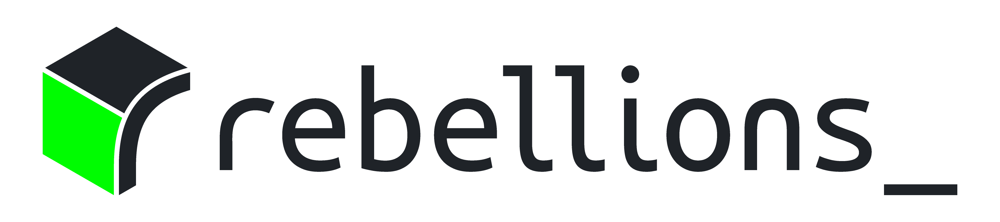

<div align="center">

<picture>
  <source media="(prefers-color-scheme: dark)" srcset="rbln-model-zoo-banner.png">
  
</picture>

*500+ models · Compile once, run anywhere · AI model serving on RBLN NPUs*

# RBLN Model Zoo

[](https://rebellions.ai/developers/model-zoo)
[](https://docs.rbln.ai)

[](https://docs.rbln.ai/supports/version_matrix.html)
[](https://docs.rbln.ai/supports/version_matrix.html)
[](https://docs.rbln.ai/supports/version_matrix.html)
[](https://docs.rbln.ai/supports/version_matrix.html)

</div>

---

## Quick Start

The `rbln-zoo` CLI **discovers** models; each model is **run from its own directory**.

**1. Discover** — install the CLI and browse the catalog:

```bash
git clone https://github.com/RBLN-SW/rbln-model-zoo.git && cd rbln-model-zoo
uv pip install -e .

rbln-zoo list -s llama      # search the catalog
rbln-zoo cards              # show card types
```

**2. Run** — from the model's directory, install its dependencies and execute:

```bash
cd huggingface/transformers/text2text-generation/llama/llama3.1-8b
uv pip install -r requirements.txt
python compile.py && python inference.py     # single-file examples: python main.py
```

> [!IMPORTANT]
> Compilation requires the RBLN Compiler from RBLN's private package index.
> See the [installation guide](https://docs.rbln.ai/latest/getting_started/installation_guide.html).

---

## CLI

`rbln-zoo` browses and filters the model catalog; it does not compile or run models.

```bash
rbln-zoo list -c RBLN-CA22 -t text2text-generation -s qwen   # filter by card, task, keyword
rbln-zoo cards                                               # card types and counts
```

| Command | Description | Flags |
|:--------|:------------|:------|
| `list` | Browse and filter models | `-c` card · `-f` framework · `-t` task · `-s` search |
| `cards` | Show card types and counts | — |

### Card types

Models are tagged with RBLN product cards — `RBLN-CA22` (ATOM™+) and `RBLN-CA25`
(ATOM™-Max) — per the [version matrix](https://docs.rbln.ai/latest/supports/version_matrix.html).
Matching is case-insensitive and honors aliases declared in
[`model_registry.yaml`](model_registry.yaml).

<details>
<summary>Example — adding a card with aliases</summary>

```yaml
cards:
  RBLN-CA22:
    description: "ATOM™+"
  RBLN-CA25:
    description: "ATOM™-Max"
  CX:
    description: "Next-gen NPU"
    aliases: [RBLN-CX01]   # -c RBLN-CX01 resolves to CX

default_cards: [RBLN-CA22, RBLN-CA25]

overrides:
  huggingface/transformers/.../model-a:
    cards: [RBLN-CA25, CX]
```

</details>

---

## Ecosystems

| Ecosystem | Models | Key packages |
|:----------|:-------|:-------------|
| Hugging Face | 150+ | transformers, diffusers |
| PyTorch | 250+ | torch |
| TensorFlow | 75+ | keras, tensorflow |

> [!NOTE]
> Model counts are approximate, as of 2026-07-13 — see the [Model Zoo](https://rebellions.ai/developers/model-zoo) for the live catalog.

**C API** — C/C++ inference bindings; install via
[APT](https://docs.rbln.ai/software/api/language_binding/c/installation.html), then build from source.

---

## Deployment

Compile a model, then serve it on a supported inference server.

### vLLM RBLN

```bash
cd huggingface/transformers/text2text-generation/llama/llama3.1-8b
python compile.py
uv pip install \
  --extra-index-url https://wheels.vllm.ai/0.24.0/cpu \
  --torch-backend cpu \
  vllm-rbln
```

```python
from vllm import LLM, SamplingParams

llm = LLM(model="Llama-3.1-8B-Instruct")
out = llm.generate(["Hello"], SamplingParams(max_tokens=64))
print(out[0].outputs[0].text)
```

> [!NOTE]
> Install commands are current as of 2026-07-13 and follow the [vLLM RBLN install guide](https://docs.rbln.ai/software/model_serving/vllm_support/vllm-rbln.html) — see it for the latest.

### Other serving options

- **[NVIDIA Triton Inference Server](https://docs.rbln.ai/software/model_serving/nvidia_triton_inference_server/installation.html)** — multi-model inference
- **[TorchServe](https://docs.rbln.ai/software/model_serving/torchserve/torchserve.html)** — PyTorch model serving

---

## Links

- [CHANGELOG](CHANGELOG.md) — release history
- [Issues](https://github.com/RBLN-SW/rbln-model-zoo/issues) — report bugs, request features or new models
